# score-bundle

**Bayesian, score-informed performance transcription** — a score graph as a structured
prior over expressive performance variables, with optional differentiable-synthesizer
likelihood.

Given a symbolic score and a performance recording, infer — with uncertainty — how each
written note was physically realized: timing, articulation, dynamics, and (for
continuously pitched instruments) intonation and vibrato. This is the *inverse* of
expressive synthesis; the score support is assumed **known**, so the task is
**score-informed performance transcription / probabilistic inverse synthesis**, not full
automatic music transcription.

> Central question: does a score-structured prior improve recovery **and** uncertainty
> calibration compared with independent or purely temporal baselines?

## Architecture



One generative model, two directions, three phases:

- **Forward (synthesis):** score + sampled expression → audio.
- **Inverse (transcription):** audio + score → posterior over expression.

The editable diagram is `docs/architecture.excalidraw`.

## Phases

| Phase | Scope | Variables added | Inference | Data |
|------:|-------|-----------------|-----------|------|
| **0 — foundation** | from-scratch symbolic music LM (backbone + representations) | — (learned prior mean `μ_LM`, note embeddings `h_i`) | next-token (autoregressive) pretraining | MAESTRO/ATEPP, Lakh, GiantMIDI |
| **1 — core (piano)** | timing, articulation, dynamics | `y = [τ, log r, v]` | closed-form Gaussian posterior over the graph field | ASAP, MAESTRO |
| **2 — extension (mono)** | intonation, vibrato | `c` (cents), `u(t)`, `f₀` | same prior, f0-derived targets | URMP, Vocadito/Opencpop |
| **3 — extension (waveform)** | timbre | harmonic amplitudes `a` | marginalize `a` exactly, Laplace/VI over nonlinear `z` | + audio |

Phase 0 (the music LM) and Phase 1 are implemented: a from-scratch tokenizer, a from-scratch
**PyTorch** Transformer (hand-written attention, `forward`/`embed`/`generate` + training
loop), and the embedding→prior-mean bridge. The Phase-1 core runs on numpy alone; the LM
needs torch (`pip install -e ".[train]"`). Phases 2 and 3 are clean interfaces with some
working helpers
(intonation/vibrato features; harmonic synthesizer; closed-form amplitude posterior) and
documented stubs for the open research steps (f0 extraction, position inference over `z`).

**Phase 0 — music language model.** A decoder-only Transformer over note-structured MIDI
tokens, built from the ground up (`src/score_bundle/lm/`). It is the generative backbone and
a representation learner: per-note embeddings `h_i` map to a learned prior mean `μ_LM`, and
the Phase-1 graph prior models the residual `y − μ_LM` with calibrated structured
uncertainty. Design + rationale in [`docs/music_lm_design.md`](docs/music_lm_design.md).

```bash
python examples/phase0_pretrain_lm.py          # pretrain the LM (needs torch)
python examples/phase0_lm_features_to_prior.py # LM embeddings → prior mean → graph posterior
```

**Phase-1 result (held-out ASAP).** With a MAESTRO-pretrained LM (val ppl 10.85), the
`LM mean + graph residual` is the best cell on both recovery and calibration — RMSE 0.373,
NLL −0.604, coverage 0.926 (target 0.90) — beating zero- and ridge-mean baselines. Full
table, per-channel breakdown, and the predictive-variance-floor fix are in
[`docs/phase1_calibration_results.md`](docs/phase1_calibration_results.md). Reproduce with
`scripts/eval_asap_calibration.py`. The aria frozen-feature upper-bound baseline
(`lm/aria_baseline.py`) is an import-guarded stub (aria not installed here).

## Install

```bash
pip install -e .            # core (numpy only)
pip install -e ".[dev]"     # + scipy, scikit-learn, pytest
```

## Quickstart

```python
import numpy as np
from score_bundle import build_adjacency, laplacian, laplacian_precision, GraphGaussianField
from score_bundle.synthetic import random_score

rng = np.random.default_rng(0)
score = random_score(60, rng)                       # S = {(p_i, b_i, d_i)}
W = build_adjacency(score, ell_b=2.0, ell_p=4.0)    # score graph
Q = laplacian_precision(laplacian(W), lam=0.5, eta=3.0)     # Q_G = λI + ηL_G
field = GraphGaussianField(Q)                       # prior y ~ N(0, Q^{-1})

y_obs = field.sample(rng) + rng.normal(scale=0.1, size=len(score))
mean, std = field.posterior(y_obs, noise_var=0.01)  # per-note estimate ± uncertainty
```

Empirical-Bayes hyperparameters:

```python
from score_bundle import fit_laplacian_field
field, hp = fit_laplacian_field(laplacian(W), y_obs)   # learns lam, eta, noise_var
```

## Examples

```bash
python examples/phase1_synthetic_recovery.py   # recovery + calibration on known latents
python examples/phase1_imputation.py           # held-out imputation vs baselines
```

The imputation example reproduces the core comparison — the score-graph prior beating the
independent, temporal-only, and ridge-feature baselines on held-out RMSE and NLL.

## Tests

```bash
pytest
```

Includes the key check `test_graph_prior_beats_independent_on_imputation` — by
construction, the graph prior must beat independent prediction on data drawn with
inter-note coupling.

## Package layout

```
src/score_bundle/
  score.py        Note / Score: the discrete support S
  graph.py        score graph: adjacency, Laplacian, kNN, chain
  prior.py        Q_G = λI + ηL_G  and  Matérn/SPDE  σ_g⁻²(κ²I + L)^α
  variables.py    phased channel registry (τ, log r, v, c, ...)
  features.py     Phase-1 target extraction from aligned data (+ ASAP loader)
  model.py        GraphGaussianField: posterior, marginal likelihood, EB fit
  baselines.py    independent / temporal AR(1) / ridge / GBM
  metrics.py      RMSE, NLL, coverage, PIT, calibration error
  synthetic.py    known-ground-truth datasets for recovery/imputation
  lm/             Phase 0: from-scratch music language model
    tokenizer.py    note-structured MIDI tokenizer (NoteEvent <-> tokens)
    data.py         synthetic corpus + next-token batching
    model_torch.py  from-scratch PyTorch Transformer (attention by hand) + training
    features.py     per-note embeddings -> learned prior mean (Phase-1 bridge)
  phase2/         intonation & vibrato (extension)
  phase3/         differentiable synthesizer Φ(z) + amplitude marginalization (extension)
docs/             architecture diagram + music_lm_design.md
examples/         runnable Phase-0 and Phase-1 scripts
tests/            unit + behavioural tests
```

## Math (Phase 1)

Known score `S = {s_i}`, `s_i = (p_i, b_i, d_i)`. Per-note variables
`y_i = [τ_i, log r_i, v_i]`. Score graph `G=(V,E)` with Laplacian `L_G`. Prior
`y ~ N(μ, Q_G⁻¹)` with `Q_G = λI + ηL_G` (or `σ_g⁻²(κ²I + L_G)^α`). Observation
`ỹ = y + e`, `e ~ N(0, Σ_e)`. Posterior:

```
Σ_y = (Q_G + Σ_e⁻¹)⁻¹,   m = Σ_y (Q_G μ + Σ_e⁻¹ ỹ)
```

Masked notes carry no likelihood term and are predicted from neighbours (imputation).
The optional waveform likelihood `x = Φ(z) a + ε` (Phase 3) marginalizes the
linear-Gaussian amplitudes `a` exactly; inference over the nonlinear `z` is the open step.

## Key references

- Lindgren, Rue & Lindström (2011), *SPDE approach to GMRFs*, JRSS-B.
- Borovitskiy et al. (2021), *Matérn Gaussian Processes on Graphs*, AISTATS.
- Engel, Hantrakul, Gu & Roberts (2020), *DDSP*, ICLR.
- Cancino-Chacón, Grachten, Goebl & Widmer (2018), *Computational Models of Expressive
  Music Performance: A Review*, Frontiers in Digital Humanities.
- Datasets: ASAP (Foscarin et al. 2020), MAESTRO (Hawthorne et al. 2019),
  ATEPP (Zhang et al. 2022), URMP (Li et al. 2019).

## License

MIT — see `LICENSE`.
