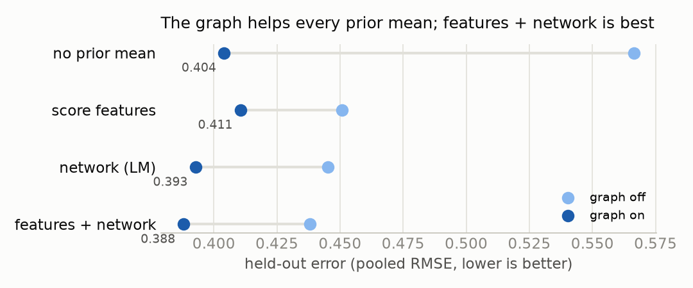
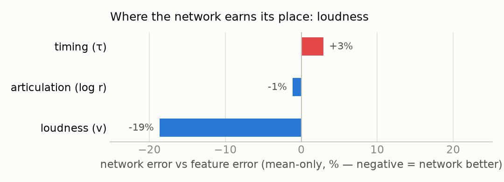
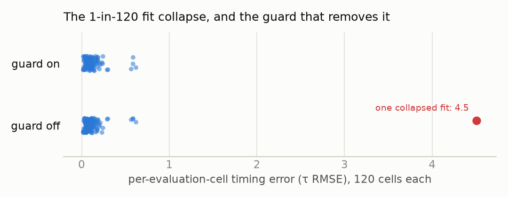

# Score-Bundle Models — one-page digest for the 2026-07-03 meeting

*Companion to `docs/status_2026-07-02.md` (§1–§10 have the full plain-language story).
Every number here comes from a re-run on held-out data; nothing is carried over from
the retracted January results.*

## What the project shows now, in one paragraph

Given the printed score and a recorded performance with some notes' expression hidden,
the system infers the hidden notes' **timing, articulation, and loudness with honest
error bars**. The two ingredients each earn a distinct place: the **score graph**
(notes connected by adjacency in time, voice, and chord) is what makes the error bars
honest and cuts error substantially over any per-note predictor; the **pretrained
network** contributes specifically *loudness* knowledge and better-calibrated
confidence. Neither claim rests on the other, and both survived a week of adversarial
checking.

## Headline numbers (held-out ASAP, 30 pieces × 4 mask seeds, strict protocol)

| System | Error (RMSE) | Confidence quality (NLL) | 90%-interval coverage |
|---|---|---|---|
| Predict zero | 0.566 | −0.007 | 87% |
| Graph alone | 0.404 | −0.308 | 92% |
| Network + graph (published headline) | **0.393** | **−0.322** | **92%** |
| Features + network + graph (candidate) | 0.388 | −0.333 | 92% |

*The candidate row was confirmed this morning under the published tuning and the same
strict protocol as the headline row — see "this morning's confirmations" below.*

## The week's three honesty results (what a referee would ask, answered first)

1. **"Is the network peeking at the answer?"** It was — we found the leak, fixed it
   (the read-out is now structurally incapable of seeing a note's own loudness),
   re-measured everything, and added a stricter protocol where hidden notes'
   loudnesses are absent from the input entirely. Cost of full strictness: ~nothing
   (error 0.3928 → 0.3930). The corrected numbers above are the strict ones.
2. **"Couldn't hand-built features do the same?"** Half yes — and we say so. On
   average error, 25 hand-built score features **tie** the network. The network's
   real, significant edge is confidence quality and loudness prediction (19% better
   RMSE on that channel). Best of all they **stack**: features + network together is
   the best system measured.
3. **"Was the training objective even aligned with the task?"** We rebuilt
   pretraining to match the task exactly (bidirectional, mask-aware) — and it did
   **not** beat the original at matched compute (error slightly worse, confidence
   tied, timing better, articulation worse; 3× compute doesn't close it). An honest
   negative worth reporting: the original read-out was already extracting what the
   objective change was supposed to unlock. En route we caught the same leak pattern
   trying to re-enter through the new read-out, which is now a documented design rule
   rather than a one-off fix.

## This morning's confirmations (run while preparing this digest)

- **Candidate headline** (features + network + graph) re-measured under the published
  tuning and protocol: **confirmed**. Error 0.388, confidence −0.333 under the strict
  protocol — better than the current headline (0.393 / −0.322) on both counts, with the
  per-piece improvements statistically significant. Full strictness again costs
  essentially nothing (error +0.0000). No fit collapses under the published tuning.
- **Fit-collapse guard**: one evaluation piece can send the error-bar fitting step
  into a wildly wrong fit (1 cell in 120; it dominated two diagnostic runs). A guard
  (validate the fit on a held-back sliver of the observed notes; fall back to a
  conservative fit if it fails) was implemented and tested this morning: on the
  published protocol it changes **nothing, bit for bit** (it never fires on a healthy
  fit); both known collapsed cells return to normal (worst case, pooled timing error
  1.58 → 0.156); every healthy cell is untouched. It is off for published numbers and
  free to enable everywhere else.

## Decision to make at the meeting

Adopt **features + network + graph** as the thesis headline system (this morning's
confirmation held), or keep **network + graph** as the headline with features
reported as an available upgrade? The first is the better number; the second is the
cleaner single-model story. The write-up supports either; the contribution claim —
*structure + calibration, with each ingredient's marginal value isolated* — is
unchanged in both.

## Figures

