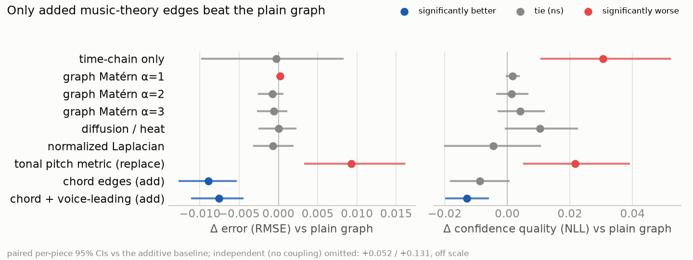

# Score-Bundle Models — meeting digest (2026-07-10)

*Every number here is from a re-run on held-out data. Follows up the 2026-07-03 digest.*

## What happened since last meeting

The kernel-comparison experiment you asked for ran end to end: eleven ways of building
the "which notes are related" structure, from no structure at all to music-theory-informed
graphs, **everything else held identical** — same test pieces, same hidden notes, same
network guess, same safety guard. Three findings, and a headline decision came out of it.

## The three findings

1. **The simple graph survives every standard alternative.** The fancier textbook
   kernels (Matérn at three smoothness settings, diffusion/heat, degree-normalized)
   all tie the plain construction on error and none improves confidence quality. The
   plainest choice was already the right one — that's now a *measured* claim, not an
   assumption.
2. **Time-adjacency alone is not enough.** A notes-in-a-row-only chain matches the full
   graph on error but its confidence quality is significantly worse: the pitch/chord
   coupling is what makes the error bars honest.
3. **Music theory helps as *extra connections*, not as a replacement ruler.** Replacing
   piano-key distance with a harmony-theoretic pitch distance (circle of fifths) made
   things significantly *worse* — expressive playing follows the keyboard, not the
   theory book. But *adding* two new kinds of connections — notes in the same chord,
   and stepwise melodic motion — gave the only improvement that is statistically
   significant on **both** error and confidence quality. The gain also holds with no
   learned guess at all, so it is a property of the structure itself.

## The adopted headline

The chord/voice-leading gain is **independent of** last week's better-guess gain — the
two compose. Per your delegation, the headline system is now:

**features + network guess + chord/voice-leading graph: error 0.379, confidence
quality −0.346, 90%-intervals covering 92%** (previous headline 0.393 / −0.322; every
step in between stays fully reported).

| System | Error (RMSE) | Confidence quality (NLL) | coverage@90% |
|---|---|---|---|
| Predict zero | 0.566 [0.50, 0.60] | −0.007 [−0.13, +0.12] | 87% |
| Graph alone | 0.404 [0.36, 0.42] | −0.308 [−0.40, −0.21] | 92% |
| Network + graph | 0.393 [0.35, 0.41] | −0.322 [−0.41, −0.24] | 92% |
| Features + network + graph | 0.388 [0.35, 0.41] | −0.333 [−0.41, −0.25] | 92% |
| **Features + network + harmonic graph** | **0.379 [0.34, 0.40]** | **−0.346 [−0.43, −0.26]** | **92%** |

Brackets are per-system 95% intervals across test pieces; they overlap because pieces
differ far more than systems do. The significance claims are *paired* piece-by-piece
comparisons, which remove that variance — each step down the table is significant on
both columns.

## Why the adoption is safe

- **Zero-leak audit (run before adopting).** Beyond the code-level checks: corrupting
  the hidden notes' answers to absurd values changes *no prediction by even one bit*,
  end-to-end through the real pipeline; corrupting hidden notes' loudness in the
  network's input leaves the guess bit-identical. Both checks are now permanent tests.
- **Three exact reproductions.** The new machinery reproduces the published headline,
  the published zero-mean cell, and the published candidate cell to the fourth decimal
  before any new claim is made.
- **Weight sensitivity — no knife-edge.** The two new edge families use untuned
  default strengths (1.0 each). A 6-variant sweep (each strength ×3 and ÷3, identical
  masks) shows the gain never reverses: every variant still beats the plain graph on
  error, significantly (−0.004 to −0.011). The strengths trade off smoothly — heavier
  chord edges buy a little more accuracy at some calibration cost, lighter ones
  attenuate the gain — and the untuned default is the setting that keeps **both**
  error and confidence quality significant, which is exactly the adoption criterion.
- **Same guard, same honesty.** The self-checking fit stayed on; it fired on at most
  one cell in 720 per variant, and every pooled table still reports median and worst
  cell.

## Decisions on the table for this meeting

1. **Next phase: audio, or write-up?** Begin Phase 3 (differentiable-synthesizer audio
   likelihood — the most novel chapter, highest research risk) or spend the time
   writing Phase 1 into thesis chapters? The Phase-1 result is finished and hardened;
   if the timeline has any pressure, writing wins.
2. **The geometry direction.** Whether to invest in the connection-Laplacian
   generalisation as a distinguishing contribution (its cheap litmus test is specced).
   Yesterday's lesson cuts both ways: theory-as-replacement hurt, theory-as-extra-edges
   helped — the gauge construction is the principled version of "extra structure".

## Where everything lives

Full tables and significance: `docs/kernel_comparison_results.md` (kernel comparison,
audit, decision), `docs/phase1_calibration_results.md` (Phase-1 evaluation),
`docs/downstream_tasks_results.md` (six demonstrations). Thesis draft: `docs/draft.tex`
(headline table now carries bootstrap CIs).
